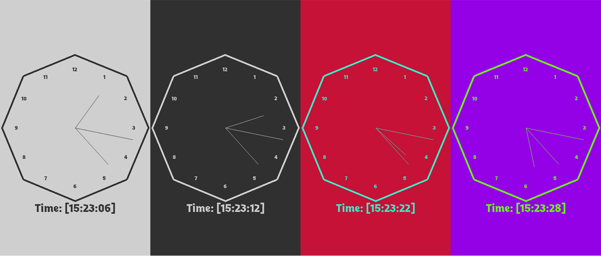

# The Big Ugly Clock (TBUC)

Uret SKAL have følgende:

- ~~12 markeringer for hver time~~ DONE (ved faktisk ikke om tallene tæller men good enough)
- ~~Et bevægeligt time, minut og sekundviser~~ DONE
- ~~Skal kunne vise det nuværende klokkeslet~~ DONE

Derefter er der fri leg på features og aesthetics, så jeg vil gerne lave:

- ~~Forskellige baggrundsfarver~~ DONE
- ~~Customizability til markeringer og form af ur~~ DONE
- ~~En form for effect til linjerne~~ orker ikke

## AI brug
Her logger jeg alt jeg har brugt AI til.  
Til dette projekt har jeg brugt:
- Claude (1x)
- (that's it)

### find_circle_points()
I find_circle_points() prøvede jeg at bruge noget bullshit matematik, og fandt hurtigt ud af at det var den forkerte tilgang. 
Jeg brugte derfor Claude fordi jeg var lost, og var i tvivl med hvordan jeg skulle fortsætte.  
NOTE: Fordi denne tilgang er rimelig vigtig for andre methods, bruger jeg stykker af denne kode flere steder.

#### Prompt:
    def find_circle_points(r):
        points = []
        pointing = True
        cur_degree = 0
    
        middle_x = screen.width/2
        middle_y = screen.height/2
        while pointing:
            points.append(pg.Vector2((middle_x+r)*math.radians(cur_degree), (middle_y+r)*math.radians(cur_degree)))
            cur_degree += 30
            if cur_degree >= 360:
                pointing = False
        return points

I am attempting to make a circle out of lines to achieve a specific effect. The effect is not your concern, I want you to help me figure out the math of making it hit the points I'm trying to hit

#### Response:
Your formula's wrong — you're multiplying (middle_x+r) by radians(cur_degree), which isn't how circle points work at all. That gives you points scaling linearly with angle, not points on a circle.

The correct parametric equations for a point on a circle:

    x = center_x + r * cos(angle_in_radians)
    y = center_y + r * sin(angle_in_radians)

So your function should be:

    def find_circle_points(r):
        points = []
        cur_degree = 0
    
        middle_x = screen.width / 2
        middle_y = screen.height / 2
    
        while cur_degree < 360:
            angle = math.radians(cur_degree)
            x = middle_x + r * math.cos(angle)
            y = middle_y + r * math.sin(angle)
            points.append(pg.Vector2(x, y))
            cur_degree += 30
    
        return points

Key fixes:

math.cos/math.sin applied separately to x and y — that's what actually traces a circle
radians(cur_degree) computed once, reused for both
Dropped the pointing flag; while cur_degree < 360 does the same job cleaner

With cur_degree += 30 you'll get 12 points evenly spaced around the circle (0°, 30°, 60°... 330°), which sounds right for connecting them with lines into a circle-ish polygon.

One thing to watch: if r is large relative to screen size, or you want the shape centered exactly, double check middle_x/middle_y are being computed once outside any resize loop — not a math issue, just a gotcha.